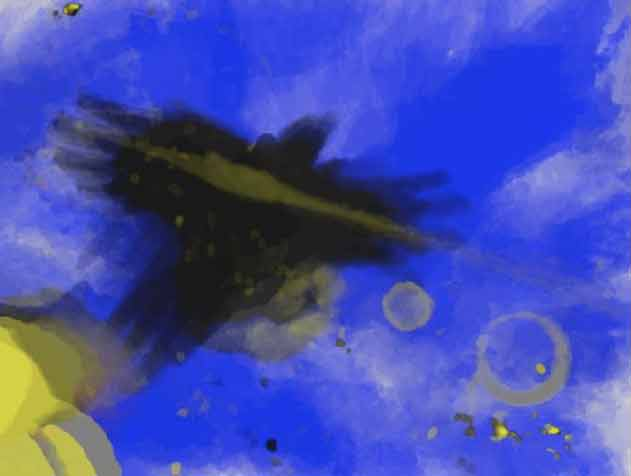

#[@KinectPainter](http://www.twitter.com/KinectPainter)

##A complete suite for creating paintings with the Kinect, choosing colors with a color picker, and posting the saved images to twitter.

I think people have been missing out on Kinect's potential, so this is one of my examples to show what is possible.  The best moments of inspiration using this have come to me while using unusual shapes as a paintbrush.  It's like foley for the eye.  One shape can represent another.  This concept is old in painting (a fanned brush for bushes) but I think could go new places with this particular tool.  For example, in one image I made a tentacle-faced creature with extension cord tentacles.  In another image I used a mug and bow to simulate a lens flare.

This project is really three projects in one:
##Screen Painter
A Processing program for painting on the screen using the input from an OpenNI depth sensor like the Kinect.  Uses the [SimpleOpenNI](https://code.google.com/p/simple-openni/) processing library.  Its colors can be toggled with the R,G, and B keys, and the screen can be filled with the Q key.  The S key saves the image to the program's directory.
##color_slider
An Arduino sketch for making a slider-based color picker that streams its settings to Screen Painter over a serial port.  This sketch is set up for 4 sliders (rgba, or red, green, blue, and alpha (opacity)) although alpha is currently disabled from the processing sketch.
##picTwitterer
A node.js program that waits for a new image to be saved in the Screen Painter directory, and then posts it to twitter.